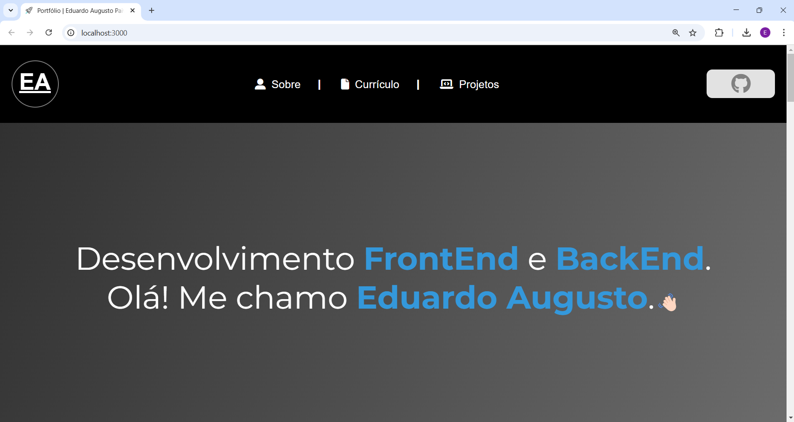

<h1 align="center">Portfólio | Eduardo Augusto Paiva Pinto</h1>

  <a href="#-projeto">Projeto</a>&nbsp;&nbsp;&nbsp;|&nbsp;&nbsp;&nbsp;
 <a href="#-tecnologias">Tecnologias</a>&nbsp;&nbsp;&nbsp;

 

  

## 💻 Projeto

Este é meu portfólio
[acesse clicando aqui](https://eduardoaugustopp-portfolio.vercel.app/).

## Tecnologias

  
       
  
  
            

